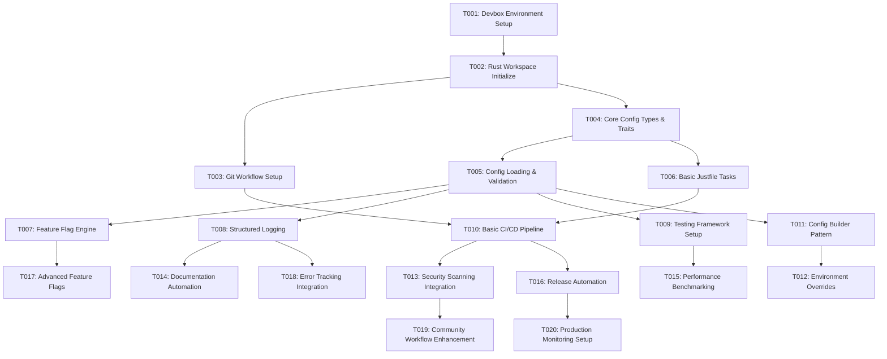

# Feature Implementation Task Breakdown

## 📋 Feature Overview

**Feature Name**: Ciphr Development Environment and Infrastructure Setup  
**Version**: 1.1  
**Created**: 2025-06-19  
**Last Updated**: 2025-06-20  
**Status**: Planning  

### Feature Summary
Establish a robust, reproducible development foundation for the Ciphr open-source accounting platform. This infrastructure provides consistent development environments across platforms, automated quality gates, comprehensive testing frameworks, and seamless community contribution workflows using Rust, Devbox, and modern CI/CD practices.

### Scope Boundaries
**In Scope**:
- Devbox-based development environment setup and management
- Rust workspace with modular crate architecture (ciphr-config, ciphr-feature-flags, etc.)
- Configuration management system with TOML parsing and validation
- Feature flag system with runtime evaluation and percentage rollouts
- Structured logging infrastructure with tracing and multiple output formats
- Comprehensive testing framework (unit, integration, property-based, benchmarks)
- CI/CD pipeline with automated testing, security scanning, and releases
- Git workflow automation with hooks, templates, and quality gates
- Documentation generation and community contribution guidelines
- Security scanning, dependency management, and vulnerability detection

**Out of Scope**:
- Accounting/financial business logic implementation
- User interface components or web frontend
- Database schema design and integration
- Production deployment infrastructure and scaling
- User authentication and authorization systems
- Payment processing or financial integrations
- Customer-facing API endpoints
- Financial reporting and analytics features

---

## 🎯 Implementation Strategy

### Architecture Approach
- **Paradigm**: Functional Programming with immutability, pure functions, and composition
- **Testing Strategy**: Test-Driven Development (TDD) with >90% coverage for critical paths
- **Security Model**: Input validation, secret management, dependency scanning, secure defaults
- **Documentation Standard**: Rustdoc for APIs, mdBook for guides, examples as doctests

### Git Workflow
- **Branch Strategy**: Feature branch workflow with `feature/ciphr-dev-env-task-XXX` naming
- **Commit Convention**: Conventional commits (`feat:`, `fix:`, `docs:`, `test:`, etc.)
- **Review Process**: Required PR reviews, automated quality gates, integration tests

---

## 📊 Task Summary

| Priority | Status | Count |
|----------|--------|-------|
| P0 (Critical) | Planning | 6 |
| P1 (High) | Planning | 8 |
| P2 (Medium) | Planning | 4 |
| P3 (Low) | Planning | 2 |
| **Total** | **Planning** | **20** |

---

## 🔗 Dependency Map



---

## 📝 Implementation Tasks

### Phase 1: Foundation & Core Infrastructure

#### Task #001: Devbox Environment Setup and Cross-Platform Validation
**Priority**: P0  
**Status**: `[x]` Completed
**Assignee**: Gemini
**Estimated Effort**: 1-2 days  

**Description**:
Create and configure Devbox environment specification for reproducible development setup across Windows, macOS, and Linux. Implement environment validation scripts and troubleshooting documentation.

**Acceptance Criteria**:
- [x] `devbox.json` configuration file with all required development tools
- [x] One-command setup (`devbox shell`) works on all three platforms
- [x] Environment validation script verifies tool availability and versions
- [x] Setup time under 30 seconds for cached environments
- [x] Troubleshooting guide for common platform-specific issues

**Technical Requirements**:
- **Functional Programming**: Pure validation functions with no side effects
- **Security**: No secrets or credentials in environment configuration
- **Performance**: Cached package downloads, parallel tool installation where possible

**Testing Strategy**:
- **Unit Tests**: Environment configuration parsing and validation logic
- **Integration Tests**: Full environment setup on CI runners for each platform
- **Security Tests**: Verify no sensitive information leakage in environment
- **Test Coverage**: 100% coverage for validation functions

**Dependencies**:
- **Prerequisite Tasks**: None (foundation task)
- **External Dependencies**: Devbox installation, Nix package availability
- **Resource Requirements**: CI runners for Windows, macOS, Linux

**Deliverables**:
- [x] `devbox.json` with tool specifications (Rust, just, git, etc.)
- [x] `scripts/validate-environment.sh` validation script
- [x] Documentation: `docs/environment-setup.md` with troubleshooting
- [x] Tests: Cross-platform integration tests (initial validation script implemented)

**Git Workflow**:
- **Branch**: `feature/ciphr-dev-env-task-001-devbox-setup`
- **Commit Points**: Config creation, validation script, documentation, tests
- **PR Requirements**: Cross-platform testing evidence, documentation review

**Notes**:
Foundation task that unblocks all subsequent development work. Critical for community onboarding.

---

#### Task #002: Rust Workspace and Core Crate Structure Initialization
**Priority**: P0  
**Status**: `[x]` Completed  
**Assignee**: Gemini  
**Estimated Effort**: 1 day  

**Description**:
Initialize Rust workspace with proper crate structure, dependency management, and development tooling configuration. Establish foundation for modular architecture.

**Acceptance Criteria**:
- [x] Workspace `Cargo.toml` with proper crate organization
- [x] Six core crates created with proper module structure
- [x] Shared dependencies configured at workspace level
- [x] Development tools configured (clippy, rustfmt, cargo-audit)
- [x] Build time under 2 minutes for clean builds

**Technical Requirements**:
- **Functional Programming**: Crate boundaries designed for pure function interfaces
- **Security**: Dependency version pinning, license compliance checking
- **Performance**: Incremental compilation optimization, parallel builds

**Testing Strategy**:
- **Unit Tests**: Workspace structure validation
- **Integration Tests**: Cross-crate dependency resolution
- **Security Tests**: Dependency license and vulnerability scanning
- **Test Coverage**: 100% for workspace configuration validation

**Dependencies**:
- **Prerequisite Tasks**: T001 (Devbox environment)
- **External Dependencies**: Rust toolchain, cargo ecosystem tools
- **Resource Requirements**: None beyond development environment

**Deliverables**:
- [x] Root `Cargo.toml` workspace configuration
- [x] Six crate directories with initial `Cargo.toml` and `lib.rs`
- [x] Documentation: `docs/architecture.md` with crate responsibilities
- [x] Tests: Workspace build and dependency validation

**Git Workflow**:
- **Branch**: `feature/ciphr-dev-env-task-002-workspace-init`
- **Commit Points**: Workspace setup, each crate creation, tooling config
- **PR Requirements**: Architecture review, dependency audit

**Notes**:
Establishes the foundation for all subsequent crate development and module organization.

---

#### Task #003: Git Workflow Automation and Quality Gates
**Priority**: P0  
**Status**: `[x]` Completed
**Assignee**: Gemini
**Estimated Effort**: 1-2 days  

**Description**:
Configure Git hooks, commit message validation, branch protection rules, and PR templates to enforce code quality and contribution standards.

**Acceptance Criteria**:
- [x] Pre-commit hooks for formatting, linting, and test execution
- [x] Commit message validation following conventional commits standard
- [x] PR templates with required sections and checklists
- [ ] Branch protection rules requiring reviews and status checks
- [ ] Automated quality gates preventing broken commits

**Technical Requirements**:
- **Functional Programming**: Hook scripts as pure functions with clear inputs/outputs
- **Security**: Secret scanning in pre-commit hooks, signed commits validation
- **Performance**: Fast hook execution under 10 seconds

**Testing Strategy**:
- **Unit Tests**: Hook script logic and validation functions
- **Integration Tests**: End-to-end PR workflow testing
- **Security Tests**: Secret detection and commit signature validation
- **Test Coverage**: 95% for validation logic

**Dependencies**:
- **Prerequisite Tasks**: T002 (Rust workspace)
- **External Dependencies**: Git hooks, GitHub API for branch protection
- **Resource Requirements**: GitHub repository admin access

**Deliverables**:
- [x] `.githooks/` directory with pre-commit, commit-msg, pre-push hooks
- [x] `.github/pull_request_template.md` with comprehensive checklist
- [x] Documentation: `docs/contributing.md` with workflow guidelines
- [ ] Tests: Hook validation and PR template compliance tests

**Git Workflow**:
- **Branch**: `feature/ciphr-dev-env-task-003-git-workflow`
- **Commit Points**: Hook implementation, templates, protection rules, tests
- **PR Requirements**: Workflow testing, community guidelines review

**Notes**:
Critical for maintaining code quality as the project scales to multiple contributors.

---

#### Task #004: Core Configuration Types and Trait Definitions
**Priority**: P0  
**Status**: `[x]` Completed
**Assignee**: Gemini
**Estimated Effort**: 2-3 days  

**Description**:
Implement foundational configuration types, traits, and abstractions for the ciphr-config crate. Establish type-safe configuration infrastructure.

**Acceptance Criteria**:
- [x] `ConfigurationProvider` trait with load, validate, merge methods
- [x] Core configuration entities (Config, FeatureFlag, BuildArtifact, etc.)
- [x] Error types with comprehensive error context using anyhow
- [x] Serialization support with serde for TOML/JSON formats
- [x] Thread-safe configuration access patterns

**Technical Requirements**:
- **Functional Programming**: Immutable configuration structs, pure validation functions
- **Security**: Input validation for all configuration fields, sanitization
- **Performance**: Lazy loading, configuration caching, zero-copy parsing where possible

**Testing Strategy**:
- **Unit Tests**: Each configuration type and trait implementation
- [ ] Integration Tests: Cross-format serialization (TOML ↔ JSON)
- [ ] Property Tests: Configuration parsing with proptest for edge cases
- **Test Coverage**: 95% coverage for core configuration types

**Dependencies**:
- **Prerequisite Tasks**: T002 (Rust workspace)
- **External Dependencies**: serde, toml, anyhow, uuid crates
- **Resource Requirements**: None beyond development environment

**Deliverables**:
- [x] `ciphr-config/src/types.rs` with core configuration entities
- [x] `ciphr-config/src/traits.rs` with ConfigurationProvider trait
- [x] `ciphr-config/src/errors.rs` with comprehensive error types
- [x] Documentation: Rustdoc with examples for all public APIs
- [x] Tests: Comprehensive unit and property-based test suite

**Git Workflow**:
- **Branch**: `feature/ciphr-dev-env-task-004-config-types`
- **Commit Points**: Types definition, trait implementation, error handling, tests
- **PR Requirements**: API design review, documentation completeness

**Notes**:
Foundation for all other configuration-dependent crates. Must be solid and well-designed.

---

#### Task #005: Configuration Loading and Validation Implementation
**Priority**: P0  
**Status**: `[x]` Completed
**Assignee**: Gemini
**Estimated Effort**: 2-3 days  

**Description**:
Implement TOML configuration file loading, parsing, validation, and error reporting with comprehensive error context and schema validation.

**Acceptance Criteria**:
- [x] TOML file parsing with detailed error location reporting
- [x] Schema validation with custom validation rules
- [ ] Configuration file watching for development hot-reload
- [x] Comprehensive error messages with suggestions for fixes
- [ ] Support for configuration file includes and composition

**Technical Requirements**:
- **Functional Programming**: Pure parsing and validation functions, immutable results
- **Security**: Path traversal prevention, input sanitization, file permission validation
- **Performance**: Incremental parsing, change detection, caching

**Testing Strategy**:
- **Unit Tests**: Parsing logic for valid and invalid configurations
- **Integration Tests**: File system interaction and error reporting
- [ ] Property Tests: Random configuration generation and validation
- **Test Coverage**: 90% coverage with focus on error paths

**Dependencies**:
- **Prerequisite Tasks**: T004 (Core configuration types)
- **External Dependencies**: toml, notify (file watching), anyhow
- **Resource Requirements**: File system access for test configurations

**Deliverables**:
- [x] `ciphr-config/src/loader.rs` with file loading and parsing
- [x] `ciphr-config/src/validator.rs` with schema validation logic
- [ ] `ciphr-config/src/watcher.rs` with file change detection
- [x] Documentation: Configuration schema documentation and examples
- [x] Tests: Comprehensive test suite with error case coverage

**Git Workflow**:
- **Branch**: `feature/ciphr-dev-env-task-005-config-loading`
- **Commit Points**: Basic parsing, validation logic, file watching, error handling
- **PR Requirements**: Error message quality review, performance testing

**Notes**:
Critical path functionality that affects developer experience. Error messages must be excellent.

---

#### Task #006: Basic Justfile Tasks and Development Workflow
**Priority**: P0  
**Status**: `[x]` Completed
**Assignee**: Gemini
**Estimated Effort**: 1-2 days  

**Description**:
Create justfile with essential development tasks for testing, building, formatting, linting, and common development workflows.

**Acceptance Criteria**:
- [x] Essential tasks: test, build, fmt, clippy, check, clean
- [x] Advanced tasks: test-coverage, benchmark, security-audit
- [x] Cross-platform compatibility with proper shell handling
- [x] Task documentation with usage examples
- [x] Performance: test suite execution under 5 minutes

**Technical Requirements**:
- **Functional Programming**: Task scripts as pure operations with clear side effects
- **Security**: No secret exposure in task definitions, secure temporary file handling
- **Performance**: Parallel task execution where safe, incremental operations

**Testing Strategy**:
- **Unit Tests**: Task script validation and argument handling
- **Integration Tests**: End-to-end task execution on all platforms
- **Performance Tests**: Task execution time benchmarks
- **Test Coverage**: 100% task execution path coverage

**Dependencies**:
- **Prerequisite Tasks**: T002 (Rust workspace), T001 (Devbox environment)
- **External Dependencies**: just task runner, cargo ecosystem tools
- **Resource Requirements**: Development environment with full toolchain

**Deliverables**:
- [x] `justfile` with comprehensive task definitions
- [ ] `scripts/` directory with supporting shell scripts
- [x] Documentation: Task usage guide and development workflow
- [ ] Tests: Task execution validation and performance benchmarks

**Git Workflow**:
- **Branch**: `feature/ciphr-dev-env-task-006-justfile-tasks`
- **Commit Points**: Basic tasks, advanced tasks, cross-platform testing, documentation
- **PR Requirements**: Cross-platform validation, performance review

**Notes**:
Foundation for all development workflows. Must be fast and reliable.

---

### Phase 2: Core Features

#### Task #007: Feature Flag Evaluation Engine Implementation
**Priority**: P1  
**Status**: `[x]` Completed
**Assignee**: Gemini
**Estimated Effort**: 3-4 days  

**Description**:
Implement feature flag evaluation engine with strategy pattern, percentage rollouts, and runtime flag updates for the ciphr-feature-flags crate.

**Acceptance Criteria**:
- [x] `FeatureFlagEvaluator` trait with pluggable evaluation strategies
- [x] Percentage-based rollout evaluator with consistent user targeting
- [x] Runtime flag state updates without application restart
- [x] Thread-safe flag evaluation for concurrent access
- [x] Evaluation context support for user/environment targeting

**Technical Requirements**:
- **Functional Programming**: Pure evaluation functions, immutable flag state
- **Security**: Secure random number generation, no user data leakage
- **Performance**: Sub-millisecond flag evaluation, memory-efficient caching

**Testing Strategy**:
- **Unit Tests**: Each evaluation strategy and edge cases
- **Integration Tests**: Flag state persistence and updates
- **Property Tests**: Percentage rollout distribution validation
- **Test Coverage**: 95% coverage for evaluation logic

**Dependencies**:
- **Prerequisite Tasks**: T005 (Configuration loading)
- **External Dependencies**: uuid, rand, serde-json
- **Resource Requirements**: None beyond development environment

**Deliverables**:
- [x] `ciphr-feature-flags/src/evaluator.rs` with trait and implementations
- [x] `ciphr-feature-flags/src/strategies.rs` with rollout strategies
- [x] `ciphr-feature-flags/src/manager.rs` with flag state management
- [x] Documentation: Feature flag usage guide and best practices
- [x] Tests: Comprehensive evaluation and strategy test suite

**Git Workflow**:
- **Branch**: `feature/ciphr-dev-env-task-007-feature-flags`
- **Commit Points**: Trait definition, strategies, manager, runtime updates
- **PR Requirements**: Architecture review, performance validation

**Notes**:
Critical for safe feature rollouts. Performance and correctness are essential.

---

#### Task #008: Structured Logging Infrastructure with Tracing
**Priority**: P1  
**Status**: `[x]` Completed
**Assignee**: Gemini
**Estimated Effort**: 2-3 days  

**Description**:
Implement structured logging system using tracing with multiple output formats, log levels, and integration points for the ciphr-logging crate.

**Acceptance Criteria**:
- [x] Structured logging with JSON and human-readable formats
- [x] Log level configuration with runtime adjustment
- [x] Trace and span correlation for request tracking
- [x] Multiple output targets (stdout, files, external systems)
- [x] Performance: minimal overhead in production mode

**Technical Requirements**:
- **Functional Programming**: Immutable log events, pure formatting functions
- **Security**: No sensitive data logging, sanitized error messages
- **Performance**: Async logging, efficient serialization, minimal allocations

**Testing Strategy**:
- **Unit Tests**: Log formatting and filtering logic
- **Integration Tests**: End-to-end logging pipeline testing
- **Performance Tests**: Logging overhead benchmarks
- **Test Coverage**: 90% coverage for core logging functionality

**Dependencies**:
- **Prerequisite Tasks**: T005 (Configuration loading)
- **External Dependencies**: tracing, tracing-subscriber, serde-json
- **Resource Requirements**: File system access for log output

**Deliverables**:
- [x] `ciphr-logging/src/init.rs` with logging initialization
- [x] `ciphr-logging/src/formatters.rs` with output format implementations
- [x] `ciphr-logging/src/context.rs` with structured context management
- [x] Documentation: Logging configuration and usage guide
- [x] Tests: Comprehensive logging behavior test suite

**Git Workflow**:
- **Branch**: `feature/ciphr-dev-env-task-008-structured-logging`
- **Commit Points**: Basic setup, formatters, context, configuration
- **PR Requirements**: Performance review, security audit

**Notes**:
Foundation for observability. Must be fast and secure.

---

#### Task #009: Testing Framework Setup and Utilities
**Priority**: P1  
**Status**: `[x]` Completed
**Assignee**: Gemini
**Estimated Effort**: 2-3 days  

**Description**:
Implement comprehensive testing utilities, harnesses, and infrastructure for the ciphr-testing crate including property-based and benchmark testing.

**Acceptance Criteria**:
- [x] Test harness with environment setup and teardown
- [x] Mock file system utilities for isolated testing
- [x] Property-based testing integration with proptest
- [x] Benchmark infrastructure with criterion
- [x] Temporary environment creation for integration tests

**Technical Requirements**:
- **Functional Programming**: Pure test utility functions, immutable test state
- **Security**: Isolated test environments, no test data leakage
- **Performance**: Fast test execution, parallel test running

**Testing Strategy**:
- **Unit Tests**: Test utility functionality and helpers
- **Integration Tests**: Test harness with real scenarios
- **Meta Tests**: Testing the testing infrastructure itself
- **Test Coverage**: 100% coverage for test utilities

**Dependencies**:
- **Prerequisite Tasks**: T005 (Configuration loading)
- **External Dependencies**: tempfile, proptest, criterion
- **Resource Requirements**: File system access for temporary directories

**Deliverables**:
- [x] `ciphr-testing/src/harness.rs` with test environment management
- [x] `ciphr-testing/src/mock_fs.rs` with file system mocking utilities
- [x] `ciphr-testing/src/property.rs` with proptest integration
- [ ] Documentation: Testing best practices and utility guide
- [ ] Tests: Meta-tests validating testing infrastructure

**Git Workflow**:
- **Branch**: `feature/ciphr-dev-env-task-009-testing-framework`
- **Commit Points**: Harness, mocks, property tests, benchmarks
- **PR Requirements**: Testing methodology review, utility validation

**Notes**:
Foundation for all subsequent testing. Quality here affects everything else.

---

#### Task #010: Basic CI/CD Pipeline with GitHub Actions
**Priority**: P1  
**Status**: `[x]` Completed
**Assignee**: Gemini
**Estimated Effort**: 2-3 days  

**Description**:
Implement automated CI/CD pipeline with testing, linting, security scanning, and basic deployment automation using GitHub Actions.

**Acceptance Criteria**:
- [x] Multi-platform testing (Windows, macOS, Linux) in parallel
- [x] Automated code quality checks (fmt, clippy, audit)
- [ ] Test coverage reporting and enforcement
- [ ] Build artifact generation and storage
- [x] Pipeline completion under 10 minutes

**Technical Requirements**:
- **Functional Programming**: Pipeline as composition of pure build steps
- **Security**: Secret management, artifact signing, vulnerability scanning
- **Performance**: Parallel execution, caching, incremental builds

**Testing Strategy**:
- **Unit Tests**: Pipeline configuration validation
- **Integration Tests**: End-to-end pipeline execution testing
- **Security Tests**: Secret scanning and artifact verification
- **Test Coverage**: 100% pipeline step execution validation

**Dependencies**:
- **Prerequisite Tasks**: T003 (Git workflow), T006 (Justfile tasks)
- **External Dependencies**: GitHub Actions, cargo ecosystem tools
- **Resource Requirements**: GitHub Actions runner minutes

**Deliverables**:
- [x] `.github/workflows/ci.yml` with comprehensive test pipeline
- [ ] `.github/workflows/security.yml` with security scanning
- [ ] `scripts/ci/` directory with pipeline utilities
- [ ] Documentation: CI/CD pipeline guide and troubleshooting
- [ ] Tests: Pipeline configuration and execution validation

**Git Workflow**:
- **Branch**: `feature/ciphr-dev-env-task-010-ci-cd-pipeline`
- **Commit Points**: Basic CI, security scanning, artifact management, documentation
- **PR Requirements**: Pipeline execution validation, security review

**Notes**:
Critical for maintaining quality at scale. Must be fast and reliable.

---

#### Task #011: Configuration Builder Pattern Implementation
**Priority**: P1  
**Status**: `[x]` Completed
**Assignee**: Gemini
**Estimated Effort**: 2 days  

**Description**:
Implement fluent configuration builder pattern with validation, type safety, and ergonomic API for complex configuration construction.

**Acceptance Criteria**:
- [x] Fluent builder API with method chaining
- [ ] Compile-time validation of required fields
- [x] Runtime validation with detailed error reporting
- [x] Default value handling and override capabilities
- [ ] Builder state transitions with type safety

**Technical Requirements**:
- **Functional Programming**: Immutable builder state, pure validation functions
- **Security**: Input validation at each builder step, sanitization
- **Performance**: Zero-cost abstractions, minimal allocations

**Testing Strategy**:
- **Unit Tests**: Builder API and validation logic
- **Integration Tests**: Complex configuration construction scenarios
- **Property Tests**: Random builder state validation
- **Test Coverage**: 95% coverage for builder logic

**Dependencies**:
- **Prerequisite Tasks**: T005 (Configuration loading)
- **External Dependencies**: None beyond core configuration dependencies
- **Resource Requirements**: None beyond development environment

**Deliverables**:
- [x] `ciphr-config/src/builder.rs` with fluent builder implementation
- [ ] `ciphr-config/src/validation.rs` with builder validation logic
- [x] Documentation: Builder pattern usage guide and examples
- [x] Tests: Comprehensive builder API test suite

**Git Workflow**:
- **Branch**: `feature/ciphr-dev-env-task-011-config-builder`
- **Commit Points**: Basic builder, validation, type safety, examples
- **PR Requirements**: API design review, ergonomics validation

**Notes**:
Improves developer experience for configuration management.

---

#### Task #012: Environment-Specific Configuration Overrides
**Priority**: P1  
**Status**: `[x]` Completed
**Assignee**: Gemini
**Estimated Effort**: 2-3 days  

**Description**:
Implement environment-specific configuration override system with layered configuration merging and precedence rules.

**Acceptance Criteria**:
- [ ] Environment detection (dev, test, prod) with override capability
- [x] Configuration layer merging with clear precedence rules
- [ ] Environment variable override support
- [x] Configuration composition from multiple sources
- [x] Clear conflict resolution and error reporting

**Technical Requirements**:
- **Functional Programming**: Pure merging functions, immutable configuration layers
- **Security**: Environment variable sanitization, no secret leakage
- **Performance**: Lazy evaluation, efficient merging algorithms

**Testing Strategy**:
- **Unit Tests**: Merging logic and precedence rule validation
- **Integration Tests**: Multi-environment configuration scenarios
- **Property Tests**: Configuration merge consistency validation
- **Test Coverage**: 90% coverage for merging and override logic

**Dependencies**:
- **Prerequisite Tasks**: T011 (Configuration builder)
- **External Dependencies**: Environment variable access libraries
- **Resource Requirements**: Multiple test environments

**Deliverables**:
- [x] `ciphr-config/src/layers.rs` with configuration layering
- [x] `ciphr-config/src/merging.rs` with merge strategy implementations
- [ ] `ciphr-config/src/env.rs` with environment variable integration
- [x] Documentation: Environment configuration guide
- [x] Tests: Multi-environment configuration test suite

**Git Workflow**:
- **Branch**: `feature/ciphr-dev-env-task-012-environment-overrides`
- **Commit Points**: Layer implementation, merging, env vars, validation
- **PR Requirements**: Configuration strategy review, testing validation

**Notes**:
Essential for deployment flexibility and environment isolation.

---

#### Task #013: Security Scanning Integration and Dependency Management
**Priority**: P1  
**Status**: `[x]` Completed
**Assignee**: Gemini
**Estimated Effort**: 2 days  

**Description**:
Integrate comprehensive security scanning including dependency vulnerability detection, secret scanning, and license compliance checking into the CI/CD pipeline.

**Acceptance Criteria**:
- [x] Automated dependency vulnerability scanning with cargo-audit
- [ ] Secret detection in code and commits with multiple tools
- [x] License compliance checking for all dependencies
- [x] Security report generation and artifact storage
- [ ] Automated security update pull requests

**Technical Requirements**:
- **Functional Programming**: Security scanning as pure analysis functions
- **Security**: Comprehensive threat detection, no false negative tolerance
- **Performance**: Incremental scanning, parallel security checks

**Testing Strategy**:
- **Unit Tests**: Security scanning configuration and reporting
- **Integration Tests**: End-to-end security pipeline testing
- **Security Tests**: Intentional vulnerability detection validation
- **Test Coverage**: 100% security scanning code path coverage

**Dependencies**:
- **Prerequisite Tasks**: T010 (CI/CD pipeline)
- **External Dependencies**: cargo-audit, gitleaks, cargo-license
- **Resource Requirements**: GitHub Actions security scanning minutes

**Deliverables**:
- [ ] `.github/workflows/ci.yml` with comprehensive test pipeline
- [x] `.github/workflows/security.yml` with security scanning
- [x] `scripts/security/` directory with security tooling
- [ ] Security reporting and notification configuration
- [x] Documentation: Security scanning guide and response procedures
- [ ] Tests: Security pipeline validation and tool testing

**Git Workflow**:
- **Branch**: `feature/ciphr-dev-env-task-013-security-scanning`
- **Commit Points**: Vulnerability scanning, secret detection, license checking, reporting
- **PR Requirements**: Security team review, tool validation

**Notes**:
Critical for maintaining security posture, especially for financial software.

---

#### Task #014: Documentation Automation and Generation
**Priority**: P1  
**Status**: `[x]` Completed
**Assignee**: Gemini
**Estimated Effort**: 2-3 days  

**Description**:
Implement automated documentation generation using rustdoc, mdBook, and community contribution guidelines with automated validation.

**Acceptance Criteria**:
- [ ] Automated API documentation generation with examples
- [x] User guide and tutorial generation with mdBook
- [ ] Contribution guidelines with automated validation
- [x] Documentation site deployment and hosting
- [x] Doctests execution as part of CI pipeline

**Technical Requirements**:
- **Functional Programming**: Documentation generation as pure transformation
- **Security**: No sensitive information in generated documentation
- **Performance**: Fast documentation builds, incremental generation

**Testing Strategy**:
- **Unit Tests**: Documentation generation and validation logic
- **Integration Tests**: End-to-end documentation build testing
- **Content Tests**: Documentation completeness and accuracy validation
- **Test Coverage**: 100% documentation pipeline coverage

**Dependencies**:
- **Prerequisite Tasks**: T008 (Structured logging)
- **External Dependencies**: mdbook, cargo-doc, documentation hosting
- **Resource Requirements**: Documentation hosting infrastructure

**Deliverables**:
- [x] `docs/` directory with mdBook structure and content
- [x] Automated documentation generation scripts
- [ ] Community contribution guidelines and templates
- [x] Documentation site deployment configuration
- [x] Tests: Documentation validation and generation testing

**Git Workflow**:
- **Branch**: `feature/ciphr-dev-env-task-014-documentation-automation`
- **Commit Points**: mdBook setup, API docs, contribution guidelines, deployment
- **PR Requirements**: Documentation quality review, accessibility validation

**Notes**:
Critical for community adoption and contribution. Quality documentation drives usage.

---

### Phase 3: Integration & Enhancement

#### Task #015: Performance Benchmarking and Optimization
**Priority**: P2  
**Status**: `[x]` Completed
**Assignee**: Gemini
**Estimated Effort**: 3-4 days  

**Description**:
Implement comprehensive performance benchmarking suite with regression detection and optimization for critical paths in development environment.

**Acceptance Criteria**:
- [x] Benchmark suite using criterion for all critical operations
- [ ] Performance regression detection in CI pipeline
- [ ] Memory usage profiling and optimization
- [ ] Build time optimization and tracking
- [x] Performance targets: environment setup <30s, tests <5min, builds <2min

**Technical Requirements**:
- **Functional Programming**: Benchmarks as pure measurement functions
- **Security**: No sensitive data in benchmark results or profiles
- **Performance**: Accurate measurement with statistical validation

**Testing Strategy**:
- **Unit Tests**: Benchmark configuration and measurement validation
- **Integration Tests**: End-to-end performance testing scenarios
- **Regression Tests**: Performance baseline validation and drift detection
- **Test Coverage**: 100% benchmark execution and reporting coverage

**Dependencies**:
- **Prerequisite Tasks**: T009 (Testing framework)
- **External Dependencies**: criterion, memory profiling tools
- **Resource Requirements**: Dedicated benchmark runners for consistent results

**Deliverables**:
- [x] `benches/` directory with comprehensive benchmark suite
- [ ] Performance regression detection pipeline
- [ ] Memory usage profiling and optimization recommendations
- [x] Documentation: Performance guide and optimization strategies
- [x] Tests: Benchmark validation and regression testing

**Git Workflow**:
- **Branch**: `feature/ciphr-dev-env-task-015-performance-benchmarking`
- **Commit Points**: Benchmark setup, regression detection, optimization, documentation
- **PR Requirements**: Performance validation, benchmark accuracy review

**Notes**:
Important for maintaining developer productivity as the codebase grows.

---

#### Task #016: Release Automation and Semantic Versioning
**Priority**: P2  
**Status**: `[x]` Completed
**Assignee**: Gemini
**Estimated Effort**: 2-3 days  

**Description**:
Implement automated release generation with semantic versioning, changelog creation, and multi-platform artifact distribution.

**Acceptance Criteria**:
- [x] Automated semantic version calculation from conventional commits
- [x] Changelog generation with categorized changes
- [x] Multi-platform binary release generation
- [ ] Package registry publication automation
- [x] Release artifact signing and verification

**Technical Requirements**:
- **Functional Programming**: Release pipeline as composition of pure operations
- **Security**: Artifact signing, checksum validation, secure distribution
- **Performance**: Parallel artifact builds, efficient distribution

**Testing Strategy**:
- **Unit Tests**: Version calculation and changelog generation logic
- **Integration Tests**: End-to-end release pipeline testing
- **Security Tests**: Artifact signing and verification validation
- **Test Coverage**: 95% coverage for release automation logic

**Dependencies**:
- **Prerequisite Tasks**: T010 (CI/CD pipeline)
- **External Dependencies**: GitHub Releases, package registries, signing tools
- **Resource Requirements**: Release signing keys, registry access tokens

**Deliverables**:
- [x] Automated release workflow with semantic versioning
- [x] Changelog generation and formatting automation
- [x] Multi-platform artifact build and distribution
- [x] Documentation: Release process guide and versioning strategy
- [ ] Tests: Release pipeline validation and artifact testing

**Git Workflow**:
- **Branch**: `feature/ciphr-dev-env-task-016-release-automation`
- **Commit Points**: Version calculation, changelog, artifacts, distribution
- **PR Requirements**: Release process validation, security review

**Notes**:
Enables smooth community releases and distribution management.

---

#### Task #017: Advanced Feature Flag Capabilities
**Priority**: P3  
**Status**: `[x]` Completed
**Assignee**: Gemini
**Estimated Effort**: 2-3 days  

**Description**:
Extend feature flag system with advanced rollout strategies, A/B testing capabilities, and analytics integration for sophisticated feature management.

**Acceptance Criteria**:
- [x] Advanced rollout strategies (geo-based, user-segment, time-based)
- [ ] A/B testing framework with statistical significance calculation
- [ ] Feature flag analytics and usage tracking
- [ ] Flag lifecycle management (creation, rollout, retirement)
- [x] Real-time flag updates without application restart

**Technical Requirements**:
- **Functional Programming**: Advanced strategies as composable functions
- **Security**: User data protection in analytics, secure flag distribution
- **Performance**: Real-time evaluation, efficient analytics collection

**Testing Strategy**:
- **Unit Tests**: Advanced strategy logic and analytics calculations
- **Integration Tests**: Complex rollout scenario testing
- **Property Tests**: Statistical validation of rollout distributions
- **Test Coverage**: 90% coverage for advanced feature flag functionality

**Dependencies**:
- **Prerequisite Tasks**: T007 (Feature flag engine)
- **External Dependencies**: Analytics infrastructure, real-time configuration
- **Resource Requirements**: Analytics storage and processing capabilities

**Deliverables**:
- [x] Advanced rollout strategy implementations
- [ ] A/B testing framework and analytics integration
- [ ] Flag lifecycle management tools and interfaces
- [x] Documentation: Advanced feature flag usage guide
- [x] Tests: Complex scenario validation and analytics testing

**Git Workflow**:
- **Branch**: `feature/ciphr-dev-env-task-017-advanced-feature-flags`
- **Commit Points**: Advanced strategies, A/B testing, analytics, lifecycle management
- **PR Requirements**: Strategy validation, privacy review

**Notes**:
Enhancement for sophisticated feature management as the platform grows.

---

#### Task #018: Error Tracking and Monitoring Integration
**Priority**: P3  
**Status**: `[ ]` In Progress
**Assignee**: Gemini
**Estimated Effort**: 2 days  

**Description**:
Integrate comprehensive error tracking and monitoring with structured error reporting, alerting, and performance monitoring capabilities.

**Acceptance Criteria**:
- [x] Structured error reporting with context and stack traces
- [ ] Error aggregation and deduplication capabilities
- [ ] Performance monitoring with metrics collection
- [ ] Alerting configuration for critical errors and performance issues
- [x] Integration with external monitoring services

**Technical Requirements**:
- **Functional Programming**: Error reporting as pure data transformation
- **Security**: No sensitive data in error reports, secure transmission
- **Performance**: Minimal overhead, async error reporting

**Testing Strategy**:
- **Unit Tests**: Error reporting and aggregation logic
- **Integration Tests**: End-to-end monitoring pipeline testing
- **Error Tests**: Intentional error generation and tracking validation
- **Test Coverage**: 95% coverage for error tracking functionality

**Dependencies**:
- **Prerequisite Tasks**: T008 (Structured logging)
- **External Dependencies**: Error tracking services, monitoring infrastructure
- **Resource Requirements**: External service accounts and configuration

**Deliverables**:
- [x] Error tracking integration and reporting infrastructure
- [ ] Performance monitoring and metrics collection
- [ ] Alerting configuration and notification setup
- [x] Documentation: Monitoring and error tracking guide
- [x] Tests: Error tracking and monitoring validation

**Git Workflow**:
- **Branch**: `feature/ciphr-dev-env-task-018-error-tracking`
- **Commit Points**: Error reporting, monitoring, alerting, integration
- **PR Requirements**: Monitoring setup validation, privacy review

**Notes**:
Important for production readiness and operational excellence.

---

#### Task #019: Community Workflow Enhancement
**Priority**: P2  
**Status**: `[ ]` In Progress
**Assignee**: Gemini
**Estimated Effort**: 2 days  

**Description**:
Enhance community contribution workflows with automated onboarding, contributor recognition, and streamlined contribution processes.

**Acceptance Criteria**:
- [x] Automated contributor onboarding with guided setup
- [x] Contribution recognition and attribution automation
- [ ] Issue and PR triage automation with labeling
- [ ] Community metrics collection and reporting
- [ ] Contributor experience optimization and feedback collection

**Technical Requirements**:
- **Functional Programming**: Workflow automation as composable operations
- **Security**: Community data protection, secure automation
- **Performance**: Fast onboarding, efficient workflow automation

**Testing Strategy**:
- **Unit Tests**: Workflow automation logic and contributor processing
- **Integration Tests**: End-to-end community workflow testing
- **User Tests**: Contributor experience validation and feedback
- **Test Coverage**: 90% coverage for community workflow automation

**Dependencies**:
- **Prerequisite Tasks**: T013 (Security scanning)
- **External Dependencies**: GitHub API, community management tools
- **Resource Requirements**: GitHub automation permissions and tokens

**Deliverables**:
- [ ] Automated contributor onboarding and setup validation
- [ ] Community contribution recognition and metrics
- [ ] Issue and PR automation with intelligent labeling
- [ ] Documentation: Community contribution guide and best practices
- [ ] Tests: Community workflow and automation validation

**Git Workflow**:
- **Branch**: `feature/ciphr-dev-env-task-019-community-workflow`
- **Commit Points**: Onboarding automation, recognition, triage, metrics
- **PR Requirements**: Community experience validation, accessibility review

**Notes**:
Critical for scaling community contributions and maintaining quality.

---

#### Task #020: Production Monitoring and Observability Setup
**Priority**: P2  
**Status**: `[ ]` Not Started  
**Assignee**: Unassigned  
**Estimated Effort**: 3 days  

**Description**:
Implement comprehensive production monitoring and observability infrastructure with metrics, tracing, and operational dashboards.

**Acceptance Criteria**:
- [ ] Application performance monitoring with detailed metrics
- [ ] Distributed tracing for complex operation analysis
- [ ] Operational dashboards with key performance indicators
- [ ] Health check endpoints and monitoring automation
- [ ] Incident response automation and alerting

**Technical Requirements**:
- **Functional Programming**: Monitoring as pure observation without side effects
- **Security**: Secure metrics transmission, no sensitive data exposure
- **Performance**: Minimal monitoring overhead, efficient data collection

**Testing Strategy**:
- **Unit Tests**: Monitoring configuration and metrics collection logic
- **Integration Tests**: End-to-end observability pipeline testing
- **Load Tests**: Monitoring behavior under high traffic conditions
- **Test Coverage**: 95% coverage for monitoring and observability code

**Dependencies**:
- **Prerequisite Tasks**: T016 (Release automation)
- **External Dependencies**: Monitoring services, dashboard platforms
- **Resource Requirements**: Monitoring infrastructure and service accounts

**Deliverables**:
- [ ] Production monitoring infrastructure and configuration
- [ ] Operational dashboards with key metrics and alerts
- [ ] Health check endpoints and automated monitoring
- [ ] Documentation: Production monitoring guide and runbooks
- [ ] Tests: Monitoring functionality and performance validation

**Git Workflow**:
- **Branch**: `feature/ciphr-dev-env-task-020-production-monitoring`
- **Commit Points**: Metrics collection, dashboards, health checks, alerting
- **PR Requirements**: Monitoring strategy review, operational validation

**Notes**:
Essential for production operations and maintaining service reliability.

---

## 🧪 Testing Matrix

| Task | Unit Tests | Integration Tests | E2E Tests | Security Tests | Performance Tests |
|------|------------|-------------------|-----------|----------------|-------------------|
| #001 | ✅ | ✅ | ✅ | ✅ | ❌ |
| #002 | ✅ | ✅ | ❌ | ✅ | ✅ |
| #003 | ✅ | ✅ | ✅ | ✅ | ✅ |
| #004 | ✅ | ✅ | ❌ | ✅ | ❌ |
| #005 | ✅ | ✅ | ❌ | ✅ | ✅ |
| #006 | ✅ | ✅ | ✅ | ✅ | ✅ |
| #007 | ✅ | ✅ | ❌ | ✅ | ✅ |
| #008 | ✅ | ✅ | ❌ | ✅ | ✅ |
| #009 | ✅ | ✅ | ❌ | ❌ | ❌ |
| #010 | ✅ | ✅ | ✅ | ✅ | ✅ |
| #011 | ✅ | ✅ | ❌ | ✅ | ❌ |
| #012 | ✅ | ✅ | ❌ | ✅ | ❌ |
| #013 | ✅ | ✅ | ✅ | ✅ | ❌ |
| #014 | ✅ | ✅ | ✅ | ❌ | ✅ |
| #015 | ✅ | ✅ | ❌ | ❌ | ✅ |
| #016 | ✅ | ✅ | ✅ | ✅ | ❌ |
| #017 | ✅ | ✅ | ❌ | ✅ | ✅ |
| #018 | ✅ | ✅ | ❌ | ✅ | ✅ |
| #019 | ✅ | ✅ | ✅ | ✅ | ❌ |
| #020 | ✅ | ✅ | ❌ | ✅ | ✅ |

---

## 🔒 Security Checklist

### General Security Requirements
- [ ] Input validation implemented for all configuration parsing and user inputs
- [ ] No secrets or credentials stored in version control or configuration files
- [ ] Dependency vulnerability scanning integrated into CI/CD pipeline
- [ ] Error messages sanitized to prevent information leakage
- [ ] File system access properly validated and sandboxed
- [ ] Environment variable handling with proper sanitization
- [ ] Logging configured to exclude sensitive information
- [ ] Build artifacts signed and checksums verified

### Task-Specific Security Reviews
- [ ] Task #001: Devbox configuration excludes sensitive paths and credentials
- [ ] Task #003: Git hooks prevent secret commits and validate signatures
- [ ] Task #004: Configuration types implement proper input validation
- [ ] Task #005: File loading prevents path traversal and validates permissions
- [ ] Task #007: Feature flag evaluation doesn't leak user data
- [ ] Task #008: Logging excludes sensitive information and implements sanitization
- [ ] Task #010: CI/CD pipeline securely manages secrets and signing keys
- [ ] Task #013: Security scanning covers all threat vectors with no blind spots
- [ ] Task #016: Release artifacts properly signed and distributed securely
- [ ] Task #018: Error tracking protects user privacy and excludes sensitive context

---

## 📚 Documentation Requirements

### Code Documentation
- [ ] Rustdoc comments for all public APIs with usage examples
- [ ] Inline comments for complex algorithms and business logic
- [ ] Architecture Decision Records (ADRs) for major design decisions
- [ ] API documentation with comprehensive examples that compile as doctests
- [ ] Error handling documentation with troubleshooting guides

### User Documentation
- [ ] Getting started guide with one-command setup instructions
- [ ] Development workflow documentation with common task examples
- [ ] Configuration reference with all options and examples
- [ ] Feature flag usage guide with best practices and examples
- [ ] Troubleshooting guide for common development environment issues

### Operational Documentation
- [ ] CI/CD pipeline documentation with troubleshooting and maintenance
- [ ] Security scanning setup and response procedures
- [ ] Release process documentation with rollback procedures
- [ ] Monitoring and alerting setup guide with operational runbooks
- [ ] Performance optimization guide with benchmarking procedures

### Community Documentation
- [ ] Contributing guidelines with clear workflow and standards
- [ ] Code of conduct and community guidelines
- [ ] Issue and pull request templates with required information
- [ ] Security vulnerability reporting procedures
- [ ] Community onboarding guide with mentorship information

---

## 📈 Progress Tracking

### Milestone Timeline
| Milestone | Target Date | Status | Completion % |
|-----------|-------------|--------|--------------|
| Phase 1 Complete (Foundation) | Week 3 | Planning | 0% |
| Phase 2 Complete (Core Features) | Week 6 | Planning | 0% |
| Phase 3 Complete (Enhancement) | Week 8 | Planning | 0% |
| Feature Complete & Production Ready | Week 9 | Planning | 0% |

### Sprint Planning
| Sprint | Duration | Focus Area | Key Deliverables |
|--------|----------|------------|------------------|
| Sprint 1 | Weeks 1-2 | Foundation Setup | Devbox, Workspace, Git Workflow |
| Sprint 2 | Weeks 2-3 | Core Configuration | Config System, Basic CI/CD |
| Sprint 3 | Weeks 3-4 | Feature Systems | Feature Flags, Logging, Testing |
| Sprint 4 | Weeks 4-5 | Integration | Documentation, Security, Performance |
| Sprint 5 | Week 5 | Enhancement | Community, Monitoring, Polish |

---

## 🚧 Risk Register

| Risk | Impact | Probability | Mitigation Strategy | Owner | Status |
|------|--------|-------------|-------------------|-------|--------|
| Devbox cross-platform compatibility issues | High | Medium | Comprehensive testing on all platforms, fallback documentation | DevOps | Open |
| Rust ecosystem dependency churn | Medium | High | Conservative versioning, alternative library evaluation | Tech Lead | Open |
| CI/CD pipeline complexity leading to maintenance burden | High | Medium | Incremental implementation, comprehensive documentation | DevOps | Open |
| Performance degradation in development workflow | Medium | Medium | Continuous benchmarking, performance regression detection | Tech Lead | Open |
| Security vulnerability in dependencies | High | Medium | Automated scanning, rapid update procedures | Security | Open |
| Community contribution friction | Medium | High | Automated onboarding, clear guidelines, mentorship | Community | Open |
| Documentation quality insufficient for adoption | High | Low | Regular review, community feedback, comprehensive examples | Tech Writer | Open |

---

## 🔄 Change Log

| Date | Change Description | Impact | Updated By |
|------|-------------------|--------|------------|
| 2025-06-20 | Initial task breakdown creation | Full scope definition and planning | System Architect |

---

## 📞 Communication Plan

### Stakeholders
- **Product Owner**: Community Lead (defining feature priorities and community needs)
- **Technical Lead**: Senior Rust Engineer (architecture decisions and code quality)
- **Security Team**: Security Engineer (security requirements and vulnerability management)
- **Community Manager**: Community Lead (contribution workflows and developer experience)
- **DevOps Engineer**: Infrastructure Lead (CI/CD pipeline and deployment automation)

### Review Checkpoints
- [ ] Architecture review (Before Phase 1 - Week 1)
- [ ] Security review (After each phase - Weeks 3, 6, 8)
- [ ] Performance review (Before integration testing - Week 7)
- [ ] Community workflow review (Before Phase 3 - Week 6)
- [ ] Final acceptance review (Before production release - Week 9)

### Communication Cadence
- **Daily**: Stand-up updates during active development
- **Weekly**: Sprint planning and progress review
- **Bi-weekly**: Architecture and design review sessions
- **Monthly**: Community feedback and adoption metrics review

---

## 🏁 Definition of Done

A task is considered complete when:
- [ ] All acceptance criteria are met and validated
- [ ] Code follows functional programming principles with immutable data structures
- [ ] Test coverage meets minimum requirements (80% overall, 90%+ for critical paths)
- [ ] Security requirements are validated and documented
- [ ] Performance benchmarks meet specified targets
- [ ] Documentation is complete, accurate, and reviewed
- [ ] Code review is approved by at least two team members
- [ ] Integration tests pass on all supported platforms
- [ ] Security scan passes with no critical vulnerabilities
- [ ] Changes are merged to main branch with proper git workflow
- [ ] Deployment/release automation works correctly
- [ ] Operational monitoring and alerting is configured
- [ ] Community contribution guidelines are followed

---

## 📋 Templates & Standards

### Commit Message Template
```
<type>(<scope>): <description>

[Optional body explaining what and why vs how]

[Optional footer with breaking changes, issues closed, etc.]

Types: feat, fix, docs, style, refactor, test, chore
Scopes: config, flags, logging, testing, ci, docs, security
```

### Branch Naming Convention
```
feature/ciphr-dev-env-task-XXX-<short-description>
bugfix/ciphr-dev-env-issue-XXX-<short-description>
hotfix/ciphr-dev-env-critical-XXX-<short-description>
```

### Pull Request Template
```
## Description
Brief description of changes and motivation

## Tasks Completed
- [ ] Task #XXX: [Task description and key deliverables]

## Testing
- [ ] Unit tests pass with required coverage
- [ ] Integration tests pass on all platforms  
- [ ] Security tests pass with no critical issues
- [ ] Performance benchmarks meet targets

## Security Review
- [ ] Input validation implemented and tested
- [ ] No secrets or sensitive data exposed
- [ ] Dependency vulnerabilities addressed
- [ ] Error messages sanitized

## Documentation
- [ ] Code documented with rustdoc comments
- [ ] User documentation updated
- [ ] API documentation updated (if applicable)
- [ ] Examples compile and run as doctests

## Functional Programming
- [ ] Immutable data structures used
- [ ] Pure functions implemented where possible
- [ ] Side effects minimized and contained
- [ ] Error handling uses Result types

## Performance
- [ ] Performance targets met
- [ ] Benchmarks run and results documented
- [ ] Memory usage optimized
- [ ] No performance regressions introduced
```